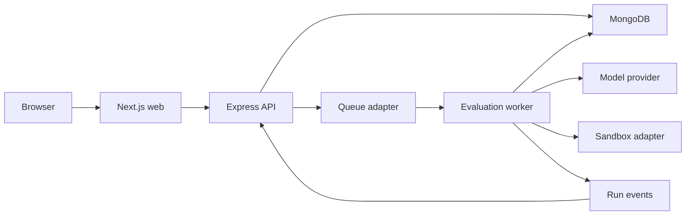

# Arbiter architecture

Arbiter is a single-operator evaluation console with a public product surface and a protected execution console.

## Boundaries

- `apps/web` owns presentation, route protection, and live event consumption.
- `services/api` owns authentication, validation, persistence, and public HTTP contracts.
- `services/worker` owns asynchronous run execution and retry policy.
- `packages/contracts` owns schemas shared by the web, API, worker, and tests.
- `packages/evaluator` owns agent turns, verifier execution, and scoring.
- `packages/sandbox` owns execution policies and Docker/Fargate adapters.
- `infra/aws` contains deployable infrastructure definitions but is never applied automatically by CI.

## Immutable evaluation inputs

Publishing a task creates a content-addressed task version. A run stores the version ID and digest. The worker reconstructs the starter workspace and read-only verifier from that version, so later edits cannot change an in-flight or historical evaluation.
